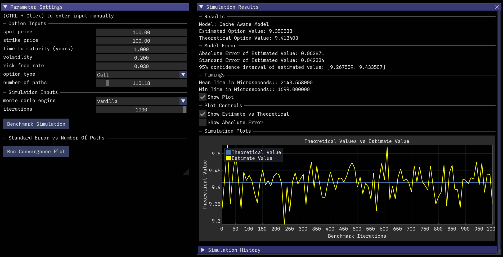
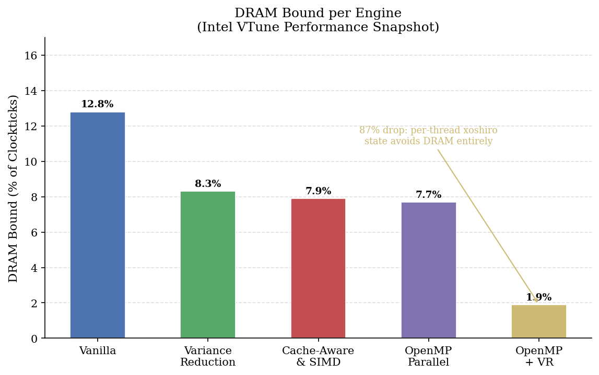

# High-Performance Monte Carlo Simulation for Low-Latency European Option Pricing

A C++23 Monte Carlo pricing engine for European options, built around a policy-based,
compile-time composable architecture. The project isolates the contribution of five
distinct optimisation layers: variance reduction, cache-aware design, AVX2 SIMD
vectorisation, and OpenMP parallelism , and validates each one empirically against
the analytical Black–Scholes price.

An interactive benchmarking application (Dear ImGui / ImPlot) sits on top of the
engine, allowing any of the five configurations to be run, compared, and visualised
in real time.



---

## Why this project exists

Monte Carlo simulation is the standard numerical method for pricing derivatives whose
payoffs are too complex for a closed-form solution (e.g. Asian Options). However it converges slowly, at a
rate of O(N⁻¹ᐟ²), meaning a 10x reduction in error requires 100x more simulated paths.
That cost is significant wherever pricing has to happen repeatedly and fast: real-time
trading, risk management, or portfolios of exotic derivatives.

This project asks a specific question: **how much of that cost can be engineered away,
layer by layer, and what does each layer actually cost or save?** Rather than building
one "optimised" engine, five engines were built as an explicit ladder each isolating
one variable so the contribution of each optimisation could be measured independently
rather than inferred.

---

## Key results

All results below were measured at N = 10⁶ paths (empirical benchmarking) or
N = 10⁹ paths (VTune hardware profiling), pricing an at-the-money European call
(S₀ = K = 100, T = 1y, r = 3%, σ = 20%) against the analytical Black–Scholes
reference price of **9.4134**.

| Engine | Speed-up vs. Vanilla | Std. Error | SE Reduction |
|---|---|---|---|
| Vanilla (Mersenne Twister, serial) | 1.00x | 0.0141 | — |
| + Antithetic variates | 0.86x | 0.0074 | **47.4%** |
| + Cache-aware / AVX2 SIMD | **1.49x** | 0.0141 | — |
| + OpenMP parallelism | **3.54x** | 0.0141 | — |
| + OpenMP + variance reduction | **3.10x** | 0.0074 | 47.3% |
---

## Profiling results
 
 
**Parallelism reduces latency and removes memory pressure entirely.**
Because each OpenMP thread owns a private xoshiro256++ generator (32 bytes, so small
enough to live in L1 cache) and a private accumulator, there's no shared mutable
state between threads. Which cuts **DRAM-bound cycles from 12.8% to 1.9%** of clock ticks
between the vanilla and fully-parallel engines.
 

 
 
---

## Download & Run (pre-built executable)

If you don't want to build from source:

1. Extract the contents of `release_backup` to a folder on your computer.
2. Ensure `glfw3.dll` and the `fonts/` directory sit alongside `main.exe`.
3. Double-click `main.exe` to launch the application.

**Prerequisites:** Windows 10/11, and the
[Microsoft VC++ Redistributable](https://learn.microsoft.com/en-us/cpp/windows/latest-supported-vc-redist)
if not already installed.

**CPU requirement:** a CPU with **AVX2 support** (essentially all Intel/AMD CPUs
since 2013). Check yours with:

```powershell
Get-CimInstance Win32_Processor | Select-Object Name
```

---

## Building from source

This project uses MSVC (Visual Studio Build Tools), CMake, and vcpkg for
dependency management.

### 1. Prerequisites

- CMake ≥ 3.20
- Visual Studio 2022 / 2026 — **Desktop development with C++** workload
- Git
- vcpkg

### 2. Install vcpkg (if not already installed)

```bash
git clone https://github.com/microsoft/vcpkg
cd vcpkg
bootstrap-vcpkg.bat
set VCPKG_ROOT=C:\path\to\vcpkg
```

### 3. Install dependencies

From the project root (dependencies are defined in `vcpkg.json`):

```bash
vcpkg install
```

### 4. Build environment

All commands must be run from the **x64 Native Tools Command Prompt for Visual
Studio**, so that `cl.exe` (the MSVC compiler) is available on the path.

### 5. Build

```bash
cmake -S . -B build -DCMAKE_BUILD_TYPE=Release
cmake --build build --config Release
```

### 6. Run

```bash
cd build/Release
main.exe
```

> **Note:** the executable must be run from inside `build/Release` — fonts and
> assets are copied next to it automatically during the build, and moving it
> elsewhere will break asset loading.

### Quick start (all steps)

```bash
cmake -S . -B build -DCMAKE_BUILD_TYPE=Release
cmake --build build --config Release
cd build/Release
main.exe
```

---

## Performance build flags

- AVX2 vectorisation: `/arch:AVX2`
- OpenMP parallelism: `/openmp`

For benchmarking, always build in `Release` or `RelWithDebInfo` — Debug builds
disable the optimisations this project measures.

---

## Project structure

```
src/            source files
fonts/          runtime UI assets
CMakeLists.txt  build configuration
vcpkg.json      dependency definitions
```

---
