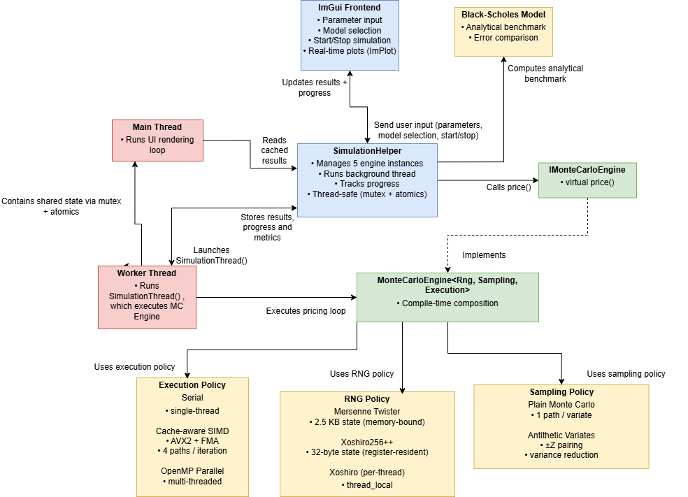
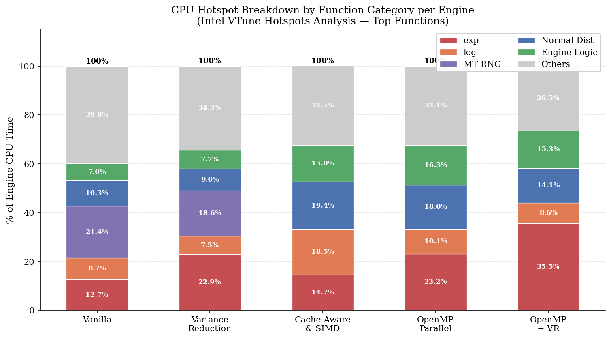
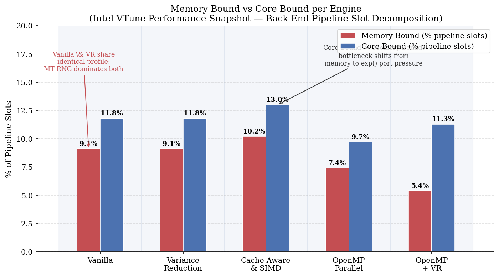
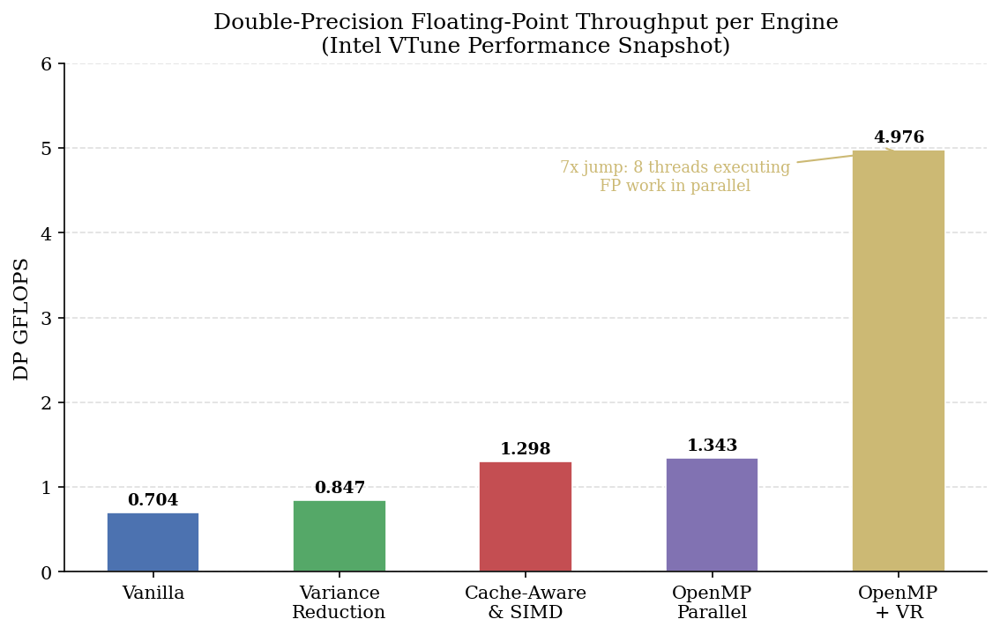
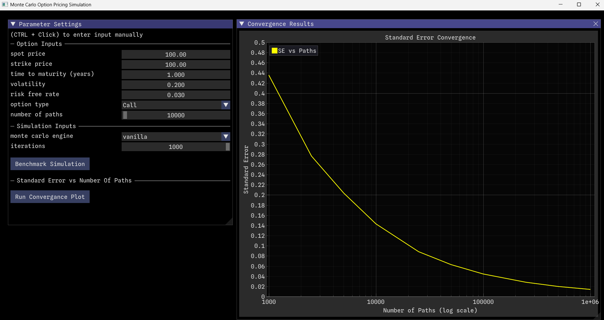

# High-Performance Monte Carlo Simulation for Low-Latency European Option Pricing

A C++23 Monte Carlo pricing engine for European options, built around a policy-based,
compile-time composable architecture. The project isolates the contribution of five
distinct optimisation layers: variance reduction, cache-aware design, AVX2 SIMD
vectorisation, and OpenMP parallelism , and validates each one empirically against
the analytical Black–Scholes price, then explains *why* it performs the way it does
using hardware-level profiling with Intel VTune.

An interactive benchmarking application (Dear ImGui / ImPlot) sits on top of the
engine, allowing any of the five configurations to be run, compared, and visualised
in real time.


---

## Why this project exists

Monte Carlo simulation is the standard numerical method for pricing derivatives whose
payoffs are too complex for a closed-form solution (e.g. Asian Options). However it converges slowly, at a
rate of O(N⁻¹ᐟ²), meaning a 10x reduction in error requires 100x more simulated paths.
That cost is significant wherever pricing has to happen repeatedly and fast: real-time
trading, risk management, or portfolios of exotic derivatives.

This project does not attempt to "beat" the black-scholes model (which is impossible) instead, this project asks a specific question: **how much of that cost can be engineered away,
layer by layer, and what does each layer actually cost or save?** Rather than building
one "optimised" engine, five engines were built as an explicit ladder each isolating
one variable so the contribution of each optimisation could be measured independently
rather than inferred.

---

## Key results

All results below were measured at N = 10⁶ paths (empirical benchmarking) or
N = 10⁹ paths (VTune hardware profiling), pricing an at-the-money European call
(S₀ = K = 100, T = 1y, r = 3%, σ = 20%) against the analytical Black–Scholes
reference price of **9.4134**.

| Engine | Speed-up vs. Vanilla | Std. Error | SE Reduction |
|---|---|---|---|
| Vanilla (Mersenne Twister, serial) | 1.00x | 0.0141 | — |
| + Antithetic variates | 0.86x | 0.0074 | **47.4%** |
| + Cache-aware / AVX2 SIMD | **1.49x** | 0.0141 | — |
| + OpenMP parallelism | **3.54x** | 0.0141 | — |
| + OpenMP + variance reduction | **3.10x** | 0.0074 | 47.3% |

Every engine's 95% confidence interval contained the true Black–Scholes price, and
every engine held standard error below the 1.5×10⁻² target at 10⁶ paths.

---

## Architecture

The engine is expressed as `MonteCarloEngine<RngPolicy, SamplingPolicy, ExecutionPolicy>`
— a C++ template parametrised over three independent, compile-time-resolved axes:
how random numbers are generated, how each path contributes to the estimator, and
how paths are distributed across hardware. Because policies resolve at compile time
rather than through virtual dispatch, the compiler can fully inline the hot path,
giving a "zero-cost abstraction" over five very different execution strategies.



This decomposition is what makes the results table above meaningful: each engine
differs from its neighbour by exactly one policy, so a performance or accuracy
delta can be attributed to a specific, named cause rather than a bundle of changes.

---

## What the profiling actually shows

Empirical wall-clock benchmarking tells you *that* something is faster. Hardware
profiling with Intel VTune (Hotspots, Memory Access, and Performance Snapshot
analyses) was used to explain *why* down to which functions, cache levels, and
CPU pipeline slots the time was going to.

**The bottleneck moves as optimisations are applied.** In the vanilla engine, the
Mersenne Twister generator and its normal-distribution transform account for ~39%
of CPU time — the engine is memory-bound, repeatedly loading a ~2.5 KB generator
state. Replacing it with the 32-byte xoshiro256++ generator and adding AVX2 SIMD
shifts the profile from memory-bound to compute-bound: Core Bound (13.0%) overtakes
Memory Bound (10.2%) for the first time, with `exp()` becoming the dominant cost.




**The variance reduction / speed trade-off is precisely quantifiable.** Antithetic
variates halve estimator variance (47% SE reduction) but double the number of
`std::exp()` calls per path, which VTune attributes to an 18.4% increase in retired
instructions (275.3B → 325.9B at N = 10⁹) — a direct, measured cost for a direct,
measured accuracy gain, and one that holds constant whether the engine is serial or
parallel.

**Parallelism doesn't just add speed — it removes memory pressure entirely.**
Because each OpenMP thread owns a private xoshiro256++ generator (32 bytes — small
enough to live in L1 cache) and a private accumulator, there's no shared mutable
state between threads. This drives an 87% reduction in last-level cache misses and
cuts DRAM-bound cycles from 12.8% (vanilla) to 1.9% (parallel), while aggregate
floating-point throughput rises 7.1x, from 0.704 to 4.976 DP GFLOPS.



The convergence plot below confirms the theoretical O(N⁻¹ᐟ²) Monte Carlo convergence
rate empirically, and visually demonstrates the antithetic engine's lower error curve
relative to the baseline at every path count.




## Download & Run (pre-built executable)

If you don't want to build from source:

1. Extract the contents of `release_backup` to a folder on your computer.
2. Ensure `glfw3.dll` and the `fonts/` directory sit alongside `main.exe`.
3. Double-click `main.exe` to launch the application.

**Prerequisites:** Windows 10/11, and the
[Microsoft VC++ Redistributable](https://learn.microsoft.com/en-us/cpp/windows/latest-supported-vc-redist)
if not already installed.

**CPU requirement:** a CPU with **AVX2 support** (essentially all Intel/AMD CPUs
since 2013). Check yours with:

```powershell
Get-CimInstance Win32_Processor | Select-Object Name
```

---

## Building from source

This project uses MSVC (Visual Studio Build Tools), CMake, and vcpkg for
dependency management.

### 1. Prerequisites

- CMake ≥ 3.20
- Visual Studio 2022 / 2026 — **Desktop development with C++** workload
- Git
- vcpkg

### 2. Install vcpkg (if not already installed)

```bash
git clone https://github.com/microsoft/vcpkg
cd vcpkg
bootstrap-vcpkg.bat
set VCPKG_ROOT=C:\path\to\vcpkg
```

### 3. Install dependencies

From the project root (dependencies are defined in `vcpkg.json`):

```bash
vcpkg install
```

### 4. Build environment

All commands must be run from the **x64 Native Tools Command Prompt for Visual
Studio**, so that `cl.exe` (the MSVC compiler) is available on the path.

### 5. Build

```bash
cmake -S . -B build -DCMAKE_BUILD_TYPE=Release
cmake --build build --config Release
```

### 6. Run

```bash
cd build/Release
main.exe
```

> **Note:** the executable must be run from inside `build/Release` — fonts and
> assets are copied next to it automatically during the build, and moving it
> elsewhere will break asset loading.

### Quick start (all steps)

```bash
cmake -S . -B build -DCMAKE_BUILD_TYPE=Release
cmake --build build --config Release
cd build/Release
main.exe
```

---

## Performance build flags

- AVX2 vectorisation: `/arch:AVX2`
- OpenMP parallelism: `/openmp`

For benchmarking, always build in `Release` or `RelWithDebInfo` — Debug builds
disable the optimisations this project measures.

---

## Project structure

```
src/            source files
fonts/          runtime UI assets
CMakeLists.txt  build configuration
vcpkg.json      dependency definitions
```

---

## Environment used for benchmarking

All performance figures quoted above were measured on a single fixed machine to
keep comparisons valid — differences between engines reflect algorithmic choices,
not hardware variance.

| | |
|---|---|
| CPU | 11th Gen Intel Core i5-1135G7 (4 cores / 8 threads) |
| Clock | 2.40 GHz base, up to 4.20 GHz Turbo |
| RAM | 16 GB |
| Cache | L1: 320 KB · L2: 5 MB · L3: 8 MB |
| Compiler | MSVC |
| Profiler | Intel VTune Profiler 2024.2 |

---

## Future work

- **SIMD-vectorised `exp()`** — the exponential evaluation is the dominant
  floating-point cost across every engine; a vectorised implementation (rather
  than scalar `std::exp`) is the clearest remaining performance win.
- **Path-dependent payoffs** (e.g. Asian options), where Monte Carlo is used in
  practice precisely because no closed-form solution exists, and where the
  performance differences between engines become commercially significant.
- **GPU acceleration** (CUDA/OpenCL) — Monte Carlo path simulation maps directly
  onto the SIMT execution model, and would likely yield order-of-magnitude gains
  over the CPU-parallel engines at large path counts.

---

## References

Core theoretical grounding: Black & Scholes (1973) on closed-form option pricing;
Boyle (1977) and Glasserman, *Monte Carlo Methods in Financial Engineering* (2004)
on Monte Carlo methods in finance; Hammersley & Morton (1956) on antithetic
variates; Blackman & Vigna (2021) on the xoshiro PRNG family; and Hennessy &
Patterson, *Computer Architecture: A Quantitative Approach* (2017), for the
memory-bound/core-bound pipeline analysis framework used in Section 6.